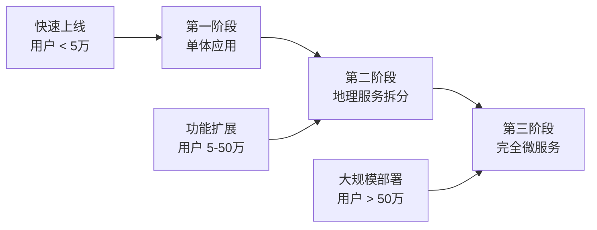

# 🚽 尿了么 (NiaoLeMo) - 智能健康检测应用

<div align="center">


[](https://spring.io/projects/spring-boot)
[](https://www.oracle.com/java/)
[](https://www.mysql.com/)
[](https://redis.io/)
[](LICENSE)

**一个基于AI的智能健康检测应用，诞生于重庆黑客松比赛**

[🚀 快速开始](#-快速开始) • [📖 文档](#-文档) • [🛠️ 技术栈](#️-技术栈) • [🤝 贡献](#-贡献)

</div>

---

## 📋 项目简介

**尿了么**是一个创新的智能健康检测应用，通过AI技术分析尿液检测结果，结合地理位置服务和社交互动功能，为用户提供便捷的健康管理体验。

### 🎯 核心功能

- 🔬 **智能检测** - 基于AI的尿液检测分析，快速获得健康报告
- 📍 **位置服务** - 智能推荐附近厕所，支持用户评价和导航
- 👥 **社交互动** - 用户评价系统，健康数据分享（匿名）
- 📊 **健康档案** - 个人健康数据管理，趋势分析
- 🏆 **成就系统** - 激励用户持续关注健康

### 🌟 项目特色

- **渐进式架构** - 支持从单体应用到微服务的平滑演进
- **安全优先** - 全面的安全防护，特别关注医疗数据保护
- **高性能** - 基于Spring Boot 3.2 + Redis缓存 + 数据库优化
- **易部署** - Docker一键部署，完整的监控和运维支持

---

## 🚀 快速开始

### 环境要求

- **Java 17+**
- **Maven 3.6+**
- **Docker & Docker Compose**
- **MySQL 8.0+**
- **Redis 7.0+**

### 一键启动

```bash
# 克隆项目
git clone https://github.com/your-username/niaolemo.git
cd niaolemo

# 启动开发环境（Windows）
.\start-dev.ps1

# 启动开发环境（Linux/Mac）
./start-dev.sh
```

### 手动启动

```bash
# 1. 启动基础服务
docker-compose up -d mysql redis rabbitmq minio

# 2. 启动应用
cd stage1-core
./mvnw spring-boot:run

# 3. 访问应用
# API文档: http://localhost:8080/doc.html
# 应用接口: http://localhost:8080/api/v1
```

---

## 🛠️ 技术栈

### 后端技术

| 技术 | 版本 | 说明 |
|------|------|------|
| **Spring Boot** | 3.2.1 | 核心框架 |
| **Spring Security** | 6.x | 安全框架 |
| **Spring Data JPA** | 3.x | 数据访问 |
| **MyBatis Plus** | 3.5.5 | ORM框架 |
| **MySQL** | 8.0 | 主数据库 |
| **Redis** | 7.0 | 缓存/会话 |
| **RabbitMQ** | 3.12 | 消息队列 |
| **MinIO** | Latest | 对象存储 |

### 监控运维

| 技术 | 说明 |
|------|------|
| **Prometheus** | 指标收集 |
| **Grafana** | 监控可视化 |
| **Docker** | 容器化 |
| **Kubernetes** | 容器编排 |

### 开发工具

| 工具 | 说明 |
|------|------|
| **Knife4j** | API文档 |
| **SonarQube** | 代码质量 |
| **OWASP ZAP** | 安全扫描 |
| **JUnit 5** | 单元测试 |

---

## 📖 API文档

启动应用后访问：**http://localhost:8080/doc.html**

### 主要接口

#### 🔐 认证相关
```http
POST /api/v1/auth/register    # 用户注册
POST /api/v1/auth/login       # 用户登录
GET  /api/v1/auth/check-username  # 检查用户名
```

#### 🔬 健康检测
```http
POST /api/v1/health/tests     # 创建检测任务
GET  /api/v1/health/tests/{id} # 获取检测结果
GET  /api/v1/health/tests     # 检测历史
```

#### 📍 位置服务
```http
GET  /api/v1/locations/toilets/nearby  # 附近厕所
POST /api/v1/locations/toilets/{id}/reviews # 添加评价
```

---

## 🏗️ 项目架构

### 架构演进路径



### 数据库设计

```sql
-- 核心表结构
users              -- 用户信息
health_tests       -- 检测记录  
test_results       -- 检测结果
analysis_reports   -- AI分析报告
toilet_locations   -- 厕所位置
toilet_reviews     -- 用户评价
```

### 安全架构

- **认证** - JWT + Spring Security
- **授权** - RBAC权限控制
- **数据保护** - 敏感数据加密存储
- **传输安全** - HTTPS + HSTS
- **输入验证** - 参数验证 + XSS防护
- **API安全** - 限流 + CSRF防护

---

## 📊 项目状态

### 开发进度

- ✅ **基础架构** (100%) - 项目框架搭建完成
- ✅ **数据库设计** (100%) - 完整的表结构设计
- ✅ **用户认证** (100%) - 注册登录功能完成
- ✅ **安全框架** (90%) - 基础安全防护到位
- 🚧 **健康检测** (30%) - 基础接口开发中
- 🚧 **位置服务** (20%) - 地理功能开发中
- ⏳ **AI集成** (0%) - 待开始
- ⏳ **移动端** (0%) - 待开始

### 测试覆盖

- **单元测试** - 目标 80%+
- **集成测试** - 核心业务流程
- **安全测试** - OWASP Top 10
- **性能测试** - 1000+ 并发用户

---

## 🔒 安全特性

### 数据保护
- 🔐 **医疗数据加密** - AES-256加密存储
- 🛡️ **传输加密** - 强制HTTPS，TLS 1.3
- 🔍 **数据脱敏** - 敏感信息输出脱敏
- 📝 **审计日志** - 完整的操作记录

### 访问控制
- 🔑 **多因素认证** - 支持短信/邮箱验证
- ⏰ **会话管理** - JWT短期有效+刷新机制
- 🚫 **权限控制** - 最小权限原则
- 🔒 **账户安全** - 登录失败锁定机制

### 攻击防护
- 🛡️ **SQL注入防护** - 参数化查询
- 🚫 **XSS防护** - 输出编码+CSP策略
- 🔄 **CSRF防护** - 令牌验证
- 📊 **API限流** - 防止暴力破解

---

## 🚀 部署指南

### 开发环境

```bash
# 使用Docker Compose
docker-compose up -d

# 或使用脚本
.\start-dev.ps1  # Windows
./start-dev.sh   # Linux/Mac
```

### 生产环境

```bash
# 1. 构建镜像
docker build -t niaolemo:latest .

# 2. Kubernetes部署
kubectl apply -f k8s/

# 3. 配置监控
helm install prometheus prometheus-community/kube-prometheus-stack
```

### 环境变量

```bash
# 数据库配置
DB_HOST=localhost
DB_USERNAME=niaolemo_user
DB_PASSWORD=your_password

# Redis配置  
REDIS_HOST=localhost
REDIS_PASSWORD=your_redis_password

# JWT配置
JWT_SECRET=your_jwt_secret_key

# MinIO配置
MINIO_ENDPOINT=http://localhost:9000
MINIO_ACCESS_KEY=minioadmin
MINIO_SECRET_KEY=minioadmin
```

---

## 📈 监控运维

### 服务监控

- **应用监控** - `/actuator/health`
- **性能指标** - Prometheus + Grafana
- **日志聚合** - ELK Stack
- **链路追踪** - Jaeger

### 告警配置

- **系统异常** - 实时邮件/短信告警
- **性能阈值** - 响应时间 > 500ms
- **安全事件** - 攻击尝试检测
- **业务指标** - 用户活跃度监控

---

## 🤝 贡献指南

### 开发流程

1. **Fork** 项目到你的GitHub
2. **创建** 功能分支 (`git checkout -b feature/AmazingFeature`)
3. **提交** 你的修改 (`git commit -m 'Add some AmazingFeature'`)
4. **推送** 到分支 (`git push origin feature/AmazingFeature`)
5. **创建** Pull Request

### 代码规范

- 遵循 **阿里巴巴Java开发手册**
- 使用 **Google Java Style**
- 单元测试覆盖率 > **80%**
- 通过 **SonarQube** 质量检查

### 提交规范

```bash
feat: 新功能
fix: 修复bug
docs: 文档更新
style: 代码格式调整
refactor: 代码重构
test: 测试相关
chore: 构建过程或辅助工具的变动
```

---

## 📄 许可证

本项目采用 [MIT License](LICENSE) 开源协议。

---

## 👥 团队

### 核心开发者

- **项目负责人** - [@your-username](https://github.com/your-username)
- **后端开发** - [@backend-dev](https://github.com/backend-dev)
- **前端开发** - [@frontend-dev](https://github.com/frontend-dev)
- **AI算法** - [@ai-engineer](https://github.com/ai-engineer)

### 特别感谢

感谢重庆黑客松比赛提供的创意灵感和技术交流平台！

---

## 📞 联系我们

- **项目主页** - [GitHub Repository](https://github.com/your-username/niaolemo)
- **问题反馈** - [Issues](https://github.com/your-username/niaolemo/issues)
- **功能建议** - [Discussions](https://github.com/your-username/niaolemo/discussions)
- **邮箱联系** - niaolemo-team@example.com

---

## 🌟 Star History

[](https://star-history.com/#your-username/niaolemo&Date)

---

<div align="center">

**如果这个项目对你有帮助，请给我们一个 ⭐ Star！**

Made with ❤️ by NiaoLeMo Team

</div>